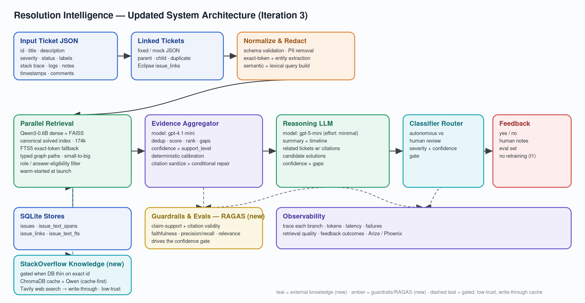

# Architecture detail — Resolution Intelligence

Supporting detail for the [main case study](README.md). This document goes one level deeper into how the pipeline is actually built, for readers who want the technical shape of the system. Verified against the team's current source code, configuration, and docs — see [github.com/venkat1596/resolution-intelligence-capstone](https://github.com/venkat1596/resolution-intelligence-capstone).

## Pipeline stages

1. **Input & linked tickets** — a structured ticket JSON (id, title, description, severity, status, labels, stack trace, comments, timestamps) plus any known linked tickets (parent/child/duplicate).
2. **Normalize & redact** — schema validation, PII removal, exact-token and entity extraction, and construction of both semantic and lexical query representations.
3. **Parallel retrieval** — dense (Qwen3-Embedding-0.6B + FAISS) and lexical (SQLite FTS5) retrieval run against the solved-issue index, plus typed-graph traversal (`duplicate_of`, `depends_on`, `blocks`, `see_also`) and a gated StackOverflow fallback when internal evidence is thin on an exact identifier.
4. **Evidence pack assembly** — deduplicated, scored, ranked evidence with stable IDs, confidence and support-level tagging, and identified gaps.
5. **Evidence aggregation** — a lower-cost model (`gpt-4.1-mini`) deduplicates and summarizes evidence sections, applies deterministic calibration, and sanitizes/repairs citations before they reach the reasoning stage.
6. **Reasoning & synthesis** — a reasoning model (`gpt-5-mini`) produces a summary, related tickets with citations, candidate resolutions, and confidence/gap assessment. It can only make claims that trace to evidence IDs from the pack.
7. **Classifier / router** — routes each case to a fully-autonomous low-risk path or a human-review path based on confidence, severity, and evidence gaps.
8. **Feedback capture** — records a yes/no signal and human notes per case as evaluation data. No automatic retraining in the current iteration.

Guardrails (RAGAS-style evaluation) and observability (Arize/Phoenix tracing of each branch, tokens, latency, and failures) run alongside this pipeline rather than as pipeline stages themselves.

## Data layer

- **SQLite** stores for issues, text spans, issue links, and the FTS5 lexical index — built from the public Eclipse issue-report dataset (Zenodo), 301,464 records.
- A **ChromaDB** cache backs the gated StackOverflow fallback source, populated write-through and queried Qwen-first (cache-first) before falling back to a live Tavily web search.
- Retrieval indexes are pre-built and warm-started at service launch rather than built on demand.

## Interfaces

- **CLI** — a `ri-workflow` command runs the pipeline end-to-end against a ticket JSON, with flags to enable synthesis (`--synthesize`), pick a retrieval method, and enable Arize tracing (`--observe`).
- **Langflow** — the same tested pipeline is wrapped in Langflow components (`RI Context Engineering → RI Eclipse RAG Retrieval → RI Evidence Pack → RI Context Aggregator → RI Reasoning Synthesis → RI Classifier Router → RI Feedback Capture`), useful for visual debugging and demos. Both a one-shot component and a staged (per-box) graph are available; neither owns retrieval, redaction, aggregation, or synthesis logic — they call the same underlying Python workflow.
- **Local UI** — a React (Vite) frontend and FastAPI backend, run via `docker compose up` and served on `http://127.0.0.1:8095`. An `Auto` mode attempts the full pipeline first and falls back to direct FTS5 search against the mounted Eclipse database if the heavier retrieval runtime isn't available in the container.

## Testing

The repository includes 17 test files covering the workflow pipeline, retrieval evaluation (including a RAGAS-style suite and an Eclipse-specific retrieval benchmark), candidate-depth auditing, guardrails and claim-support checks, aggregation, EDA, and the SQLite database layer.

## What's verified vs. what's stale

The team's docs contain some stale references from earlier experiments (for example, one architecture doc references an older model name that doesn't match the current default configuration). This case study uses the configuration confirmed by current code (`pyproject.toml`, `docker-compose.yml`, `.env.example`) and the most recently updated evaluation artifacts, not older planning documents, per the precedence described in the main case study.
